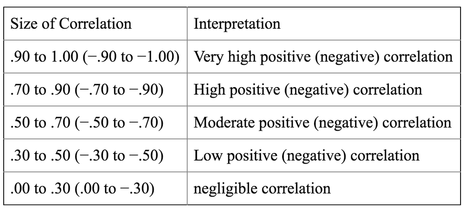

# ms_challenge
Repositório para compartilhamento das resoluções do desafio 01 microsoft, referente a trilha engenheiro de IA.

A proposta para o desafio pode ser encontrada em: https://github.com/flaviocalado-anima/ms-challenge-2021

Resolvi realizar o desafio utilizando python e não o recurso Desiger do Azure, pois tinha o intuito de compreender melhor os algoritimos.

## Primeiro Passo: Análise Exploratória dos Dados
A primeira tarefa executada foi uma análise exploratória dos dados utilizando notebooks do Azure Machine Learning Studio. 
Os códigos utilizados nos notebooks se encontram no diretório notebooks.

O desafio solicita a previsão de uma nota de Ciências da Natureza no Enem, através de um nota de Matemática. 
Com isso, é necessário verificar se os valores possuem alguma correlação. 
Essa validação é feita através do coeficiente de pearson e está disponível através de um método do módulo pandas.
Para melhor visualização utilizei uma representação gráfica do módulo seaborn chamad heatmap.

  

Como é possível notar, as notas de matemática e ciências da natureza tem um coeficiente de correlação de 0.65, 
segundo a literatura este nível de correlação é considerado moderado:

  

Portanto é possível, realizar um regressão linear porém com um precisão não tão alta. 
Um ponto interessante que pode ser notado na análise de correlações é a forte correlação positiva entre as notas de linguagens e códigos com as demais. 
Uma hipótese para a causa destas correlações mais fortes, pode ser o grau interpretativo das questões do ENEM, o que favorece quem tem melhores conceitos de linguagens.

Essa análise de correlação moderada entre as notas de matemática e ciências da natureza também pode ser vista, através do seguinte gráfico, 
criado com o módulo matplolib do python.

  

## Segundo Passo: Aplicação Estatística
Para realizar a aplicação estatística utilizei fórmulas básicas de regressão linear simples:

  

Através dessas fórmulas aplicadas em código foi possível obter a equação da reta utilizando os dados de treinamento (80% do total):

  

## Terceiro Passo: Validação do Algorítimo
Trocando os dados de treinamento pelos dados de teste (20% do total), obtive os seguintes resultados:

  

  

  

  

  

## Quarto Passo: Calculando Erros
Utilizando os cáculos de erro absoluto médio (MAE) e erro quadrático médio (RMSE) do módulo sklearn do python, comumente utilizados para avaliar a precisão da regressão linear obtive os seguintes resultado:

####### MAE: 46.7169
####### RMSE: 57.7639

Estes erros são considerados altos para um regressão linear, portanto é possível explorar outros métodos além da regressão linear simples para realizar previsões
